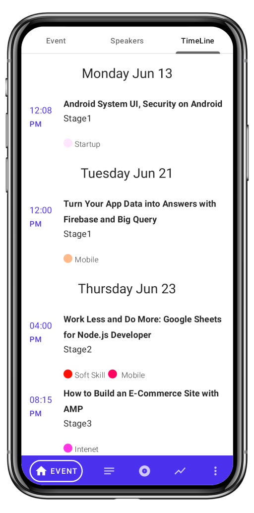

# Event App Sample Application

This is an open-source project to display how you can create your own custom Event App application
within a few minutes. I have already created an Event
App [click to see Sample AppUi on your browser](https://app.formaloo.net/SyXTyVRWqfuSjhl).

You can
also [download](https://drive.google.com/file/d/1XU3cCsvH9pKIDOgLhxohBWm9PPsTfb63/view?usp=sharing)
and install the demo application.

<table>
  <tr>
<td align="center"></td>
<td align="center"></td>
<td align="center"></td>
<td align="center"></td>
  </tr>
  <tr>
<td align="center"></td>
<td align="center"></td>
<td align="center"></td>
<td align="center"></td>
    </tr>

<tr>
<td align="center"></td>
<td align="center"></td>
<td align="center"></td>
<td align="center"></td>
    </tr>
</table>

Clone this repository and import it into **Android Studio**

git clone [https://github.com/formaloo/???.git](https://github.com/formaloo/android-event-app.git)

First of all, we need X-API-KEY.

You can find your X-API-KEY on your [CDP Dashboard](https://cdp.formaloo.net/) and create a
Connection to get your API_KEY.

Now you just need one more key: The appUI address code. Copy the code at the end of the URL. For
instance in this URL  https://app.formaloo.net/SyXTyVRWqfuSjhl the appUI address code is
SyXTyVRWqfuSjhl.

Copy these two keys and paste them in the api.propertise.txt file inside your android project:

Now Define build configuration fields in the Gradle file. These constants will be accessible at
runtime as static fields of the BuildConfig class:

Your Application is almost ready.

You just need some customization like colors, app name, etc. If you are new to android you can use
following steps to customize your project:

# Theming

Find the feature/home module. under ui folder you can see theme folder It contains the following
classes.

Color.kt - for custom colors

Shape.kt - for custom shapes

Type.kt - for custom typography

Theme.kt - for custom themes

You can define your own Colors and Fonts, Material theme function inside Theme file update the
entire app theme:

MaterialTheme(
colors = …, typography = …, shapes = …
)

# Application id

The last item you need to change to have your own application is the package name and application
id, follow the images to rename the ids:

1. 
2. 

We are done, our Event App is ready :)
Run the project and test the application.

